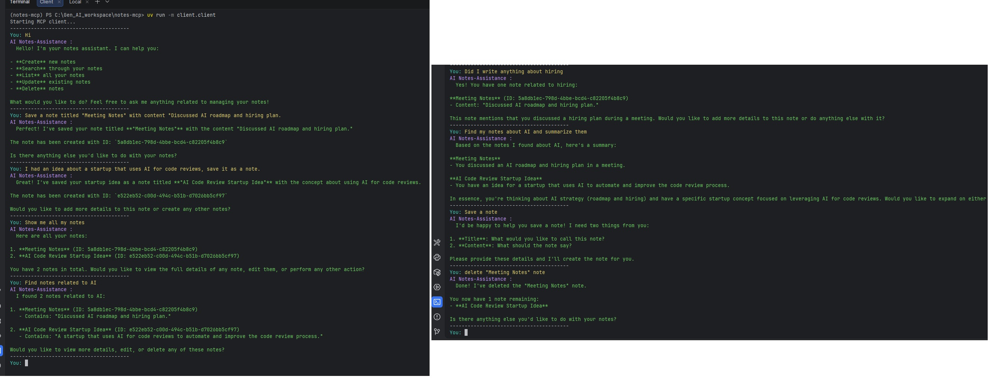
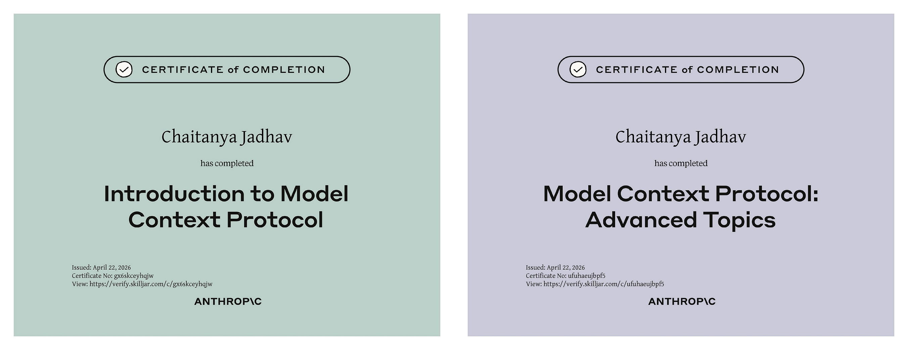

# NotePilot (Notes Assistant AI Chat App)
Turn thoughts into structured knowledge..!

A minimal **Notes** application built on the [Model-Context-Protocol (MCP)](https://modelcontextprotocol.io). A Python MCP server exposes note management tools over stdio; an async client connects Claude AI to those tools so you can create, search, and manage notes through a natural-language chat interface.

## Overview

```
You ──► Claude AI (Anthropic) ──► MCP Client ──► MCP Server ──► SQLite
              (tool calls)          (stdio)       (FastMCP)     (notes.db)
```

Claude receives a set of note-management tools from the MCP server. When you ask it to "create a note about X" or "find notes mentioning Y", it invokes the appropriate tool, gets the result, and responds conversationally.

## Tech Stack

| Layer | Technology |
|---|---|
| Language | Python 3.12+ |
| Package manager | [uv](https://docs.astral.sh/uv/) |
| MCP framework | [mcp\[cli\]](https://pypi.org/project/mcp/) (FastMCP) |
| AI / LLM | [Anthropic SDK](https://pypi.org/project/anthropic/) (AsyncAnthropic) |
| Database | SQLite via [sqlite-utils](https://sqlite-utils.datasette.io/) |
| CLI formatting | [colorama](https://pypi.org/project/colorama/) |
| Config | python-dotenv |

## Prerequisites

- Python 3.12+
- [uv](https://docs.astral.sh/uv/getting-started/installation/) installed
- An [Anthropic API key](https://console.anthropic.com/)

## Configuration

Create a `.env` file in the project root:

```env
ANTHROPIC_API_KEY="sk-ant-..."
CLAUDE_MODEL="claude-haiku-4-5-20251001"
```

## Installation

```bash
# Clone the repo
git clone https://github.com/chaitanya-jadhav11/notes-mcp
cd notes-mcp

# Install dependencies
uv sync
```

## Usage

```bash
# Start the interactive chat client
uv run -m client.client
```

You can then chat naturally with Claude. Examples:

```
You: Create a note titled "Shopping list" with milk, eggs, and bread.
You: Show me all my notes.
You: Search for notes about bread.
You: Update the shopping list to add butter.
You: Delete the shopping list note.
```

To inspect or develop the MCP server interactively:

```bash
uv run mcp dev server/server.py
```

## Project Structure

```
notes-mcp/
├── .env                    # API key and model config (create this)
├── pyproject.toml          # Project metadata and dependencies
├── uv.lock                 # Pinned dependency lock file
├── notes.db                # SQLite database (auto-created on first run)
│
├── server/
│   ├── server.py           # FastMCP server — defines the 8 note tools
│   └── db.py               # SQLite CRUD layer (UUID keys, ISO timestamps)
│
└── client/
    ├── client.py           # MCPClient class + interactive REPL loop
    └── claude_client.py    # Anthropic API wrapper — manages conversation
                            # history, tool-call loops, and prompt caching
```

## Available MCP Tools

The server exposes the following tools to Claude:

| Tool | Description |
|---|---|
| `list_notes` | List all notes (id + title) |
| `create_note` | Create a note with a title and body |
| `get_note_by_id` | Fetch a single note by UUID |
| `get_notes_by_title` | Find notes by exact or partial title match |
| `search_notes` | Full-text search across note bodies |
| `update_note` | Update a note's title and/or body |
| `delete_note_by_id` | Delete a note by UUID |
| `delete_notes_by_title` | Delete all notes matching a title |


## App Screenshot 


## Anthropic course certificate



